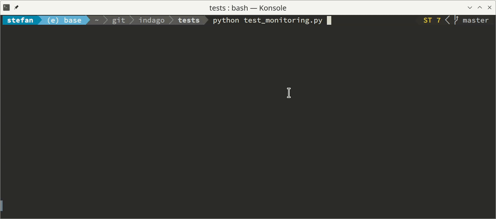
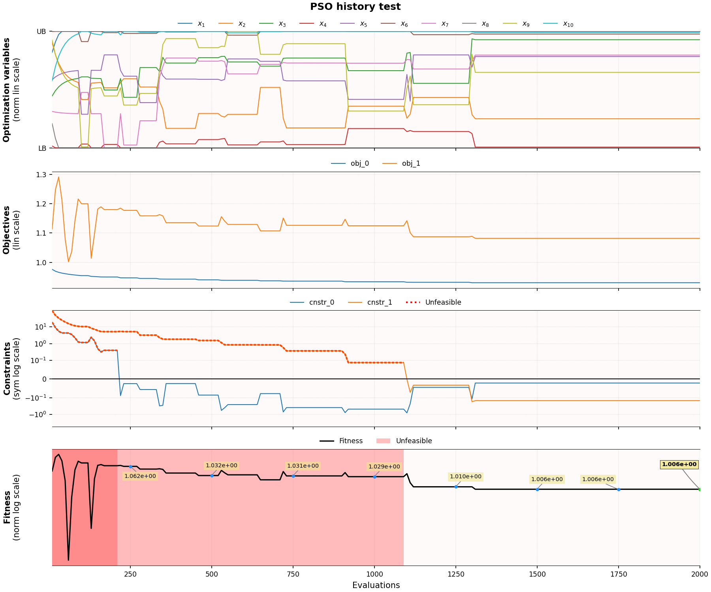

# Getting started

Indago is a Python 3 module for numerical optimization.

Indago contains several modern methods for real fitness function optimization over a real parameter domain. It was developed at the Department for Fluid Mechanics and Computational Engineering of the University of Rijeka, Faculty of Engineering, by Stefan Ivić, Siniša Družeta, Luka Grbčić, and others. 

Indago is developed for in-house research and teaching purposes and is not officially supported in any way, comes with no guarantees whatsoever and is not properly documented. However, we use it regulary and it seems to be working fine. Hopefully you will find it useful as well.

**Important: After every Indago update please check this documentation since Indago methods and API can undergo significant changes at any time.**

## Installation

You can install Indago via pip:
```
pip install indago
```
If you wish to update your existing Indago installation, just do:
```
pip install indago --upgrade
```

## Optimization problem setup

Using Indago is easy. The setup of the optimization problem in Indago is the same regardless of the used optimization method. Say we want to optimize a function in 8 dimensions, with constraints:
```python
# Evaluation function
def goalfun(x):
    obj = np.sum(x ** 2)  # minimization objective
    constr1 = x[0] - x[1]  # constraint x_0 - x_1 <= 0
    constr2 = - np.sum(x)  # constraint sum x_i >= 0
    return obj, constr1, constr2

# Initialize the chosen method
from indago import PSO  # ...or any other Indago method
optimizer = PSO()

# Optimization variables settings
optimizer.lb = -10  # lower bound, here given as scalar (equal for all variables)
optimizer.ub = 10 + np.arange(8)  # upper bounds, here given as np.array (one bound value per each of the 8 variables)

# Set evaluation function
optimizer.evaluation_function = goalfun  

# Objectives and constraints settings
optimizer.objectives = 1  # number of objectives (optional parameter, default objectives=1), this is obj in evaluation function
optimizer.objective_labels = ['Squared sum minimization']  # labels for objectives (optional parameter, used in reporting)
optimizer.constraints = 2  # number of constraints (optional parameter, default constraints=0), these are constr1 and constr2 in evaluation function
optimizer.constraint_labels = ['Constraint 1', 'Constraint 2']  # labels for constraints (optional parameter, used in reporting)

# Print optimizer parameters
print(optimizer)  # not necessary, but useful for checking the setup of the optimizer

# Run optimization
result = optimizer.optimize()  # (using default parameters of the method)

# Extract results
print(result.f)  # minimum of obj with constr1 and constr2 satisfied
print(result.X)  # design vector at minimum
```
Alternatively, you can achieve the same by using a shorthand one-line solution, which is also available in Indago:
```python
from indago import minimize
X, f = minimize(goalfun, -10, 10 + np.arange(8), 'PSO', 
                objectives=1, objective_labels=['Squared sum minimization'], 
                constraints=2, constraint_labels=['Constraint 1', 'Constraint 2'])
```
Instead of stating `'PSO'` as the method you want to use, you can use a different one, or easily iterate through all the available methods, as they are listed in `indago.optimizers_name_list` and `indago.optimizers_dict`. The default method is `'PSO'`.

## Methods

As of now, Indago includes the following stochastic global optimization methods: 

- Particle Swarm Optimization (PSO) [1]
- Fireworks Algorithm (FWA) [2]
- Squirrel Search Algorithm (SSA) [3]
- Differential Evolution (DE) [4]
- Bat Algorithm (BA) [5]
- Electromagnetic Field Optimization (EFO) [6]
- Manta Ray Foraging Optimization (MRFO) [7]
- Artificial Bee Colony (ABC) [8]
- Gray Wolf Optimizer (GWO) [9]
- Heap-Based Optimizer (HBO) [10]
- Controlled Random Search (CRS) [11]
- Random Search (RS)

and gradient-free local search methods: 

- Nelder-Mead method (NM) [12]
- Multi-Scale Grid Descent (MSGD) [13]

These methods are available through a unified API, which was designed to be as accessible as possible. Indago relies heavily on *NumPy*, so the inputs and outputs of the optimizers are mostly *NumPy* arrays. Besides *NumPy*, Indago uses only *Matplotlib*, a couple of *SciPy* functions, and *rich* for fancy console printouts. Indago methods also include some of our original research improvements, so feel free to try those as well.

### Particle Swarm Optimization

Let us use PSO as a primary step-by-step example. First, we need to import NumPy and Indago PSO, and then initialize an optimizer object:
```python
import numpy as np
from indago import PSO
pso = PSO() 
```
Then, we must provide a goal function which needs to be minimized, say:
```python
def goalfun(x):	# must take 1d np.array
    return np.sum(x**2)  # must return scalar number
pso.evaluation_function = goalfun
```
Now we can define optimizer inputs:
```python
pso.variant = 'Vanilla'  # we will use Standard PSO, the other available options are 'TVAC' [14] and 'Chaotic' [15]; default variant='Vanilla'
pso.dimensions = 20  # number of variables in the design vector (x) (optional, if not given will be infered from lb/ub)
pso.lb = np.ones(pso.dimensions) * -1  # 1d np.array of lower bound values (if scalar value is given, it will automatically be transformed to 1d np.array of size dimensions); for (semi-) unbound problems, use (-)np.inf or np.nan, or omit entirely 
pso.ub = np.ones(pso.dimensions) * 1  # 1d np.array of upper bound values; see above for other considerations
pso.max_iterations = 1000  # optional maximum allowed number of method iterations; when surpassed, optimization is stopped (if reached before other stopping conditions are satistifed)
pso.max_evaluations = 5000  # optional maximum allowed number of function evaluations; when surpassed, optimization is stopped (if reached before other stopping conditions are satistifed); if no stopping criteria given, default max_evaluations=50*dimensions**2
pso.target_fitness = 10**-3  # optional fitness threshold; when reached, optimization is stopped (if it didn't already stop due to exhausted pso.max_iterations or pso.maximum_evaluations)
```
Also, we can provide optimization method parameters:
```python
pso.params['swarm_size'] = 15  # number of PSO particles; default swarm_size=max(10, dimensions)
pso.params['inertia'] = 0.8  # PSO parameter known as inertia weight w (should range from 0.5 to 1.0), the other available options are 'LDIW' (w linearly decreasing from 1.0 to 0.4), 'HSIW' (w changing from 0.5 to 0.75 and back, in a half sine wave), and 'anakatabatic' (explained below); default inertia=0.72
pso.params['cognitive_rate'] = 1.0  # PSO parameter also known as c1 (should range from 0.0 to 2.0); default cognitive_rate=1.0
pso.params['social_rate'] = 1.0  # PSO parameter also known as c2 (should range from 0.0 to 2.0); default social_rate=1.0
```

If we want to use our novel adaptive inertia weight technique [16, 17, 18], which will often produce faster convergence and better accuracy, we invoke it by:
```python
pso.params['inertia'] = 'anakatabatic'
```
and then we need to also specify the anakatabatic model:
```python
pso.params['akb_model'] = 'Languid'  # other options explained below
```
Apart from `'Languid'` [17], we can use `'TipsySpider'`, `'FlyingStork'` or `'MessyTie'` models for Vanilla PSO, and `'RightwardPeaks'` or `'OrigamiSnake'` models for TVAC PSO [16]. According to our experience, your best bets are `'Languid'` and `'TipsySpider'`.

We can enable reporting during the optimization process by providing the monitoring argument:
```python
pso.monitoring = 'basic'  # other options are 'none' and 'dashboard'; default monitoring='none'
```

Finally, we can start the optimization and retrieve the results:
```python
result = pso.optimize()
min_f = result.f  # fitness at minimum, scalar number
x_min = result.X  # design vector at minimum, 1d np.array
```
And that's it!

(If you're using the `indago.minimize` function instead, note that `params` used above is a Python dict, hence it should be prepared as such and then given as a keyword argument, e.g. `params={'swarm_size': 15, 'inertia': 0.8}`).

### Fireworks Algorithm

If we want to use FWA [2], we just have to import it instead of PSO:
```python
from indago import FWA
fwa = FWA()
```
Now we can proceed in the same manner as with PSO. 

For FWA, there are two versions: *Vanilla* (fitness-based, ignores contraints) and *Rank* (rank-based, supports using constraints):
```python
fwa.variant = 'Rank'  # the other option is 'Vanilla' which does not support constraints; default variant='Rank'
```
In FWA we can set the following method parameters:
```python
fwa.params['n'] = 20  # default n=dimensions
fwa.params['m1'] = 10  # default m1=dimensions/2
fwa.params['m2'] = 10  # default m2=dimensions/2
```

### Squirrel Search Algorithm

We can try our luck also with SSA [3]. We initialize it like this:
```python
from indago import SSA
ssa = SSA()
```

In SSA, the only available variant is *Vanilla* (which is set as default), and there are two method parameters:
```python
ssa.params['pop_size'] = 15  # number of squirrels; default pop_size=max(20, 2*dimensions)
ssa.params['ata'] = 0.6  # acorn tree attraction; ranges from 0.0 to 1.0; default ata=0.5
```
If we want to fine-tune the method, we can define a few other SSA parameters:
```python
ssa.params['p_pred'] = 0.15  # predator presence probability; default p_pred=0.1
ssa.params['c_glide'] = 1.9  # gliding constant; default c_glide=1.9
ssa.params['gd_lim'] = [0.5, 1.11]  # gliding distance limits; default gd_lim=[0.5, 1.11]
```

### Differential Evolution

If we want to use DE [4], we initialize it in the same way as with the other methods:
```python
from indago import DE
de = DE()
```
There are two DE variants implemented, namely SHADE and LSHADE. Say we want to use SHADE:
```python
de.variant = 'SHADE'  # default variant='LSHADE'
```
Both DE variants use the following parameters:
```python
de.params['pop_init'] = 200  # initial population size; default pop_init=max(30, 5*dimensions)
de.params['f_archive'] = 3  # external archive size factor; default f_archive=2.6
de.params['hist_size'] = 4  # historical memory size; default hist_size=6
de.params['p_mutation'] = 0.2  # default p_mutation=0.11
```
DE implementation does not (yet) support using constraints.

### Bat Algorithm 

For using BA [5], we initialize it in the same way as with the other methods:
```python
from indago import BA
ba = BA()
```
The only BA version implemented is the original Bat Algorithm [5] with mutation modified to make it fitness-scalable. We specifiy it as:
```python
ba.variant = 'Vanilla'
```
The following parameters are used:
```python
ba.params['pop_size'] = 15  # default pop_size=max(15, dimensions)
ba.params['loudness'] = 1  # default
ba.params['pulse_rate'] = 0.001  # default
ba.params['alpha'] = 0.9  # default 
ba.params['gamma'] = 0.1  # default 
ba.params['freq_range'] = [0, 1]  # default
```

### Electromagnetic Field Optimization 

To use EFO [6], we initialize it in the same way as shown above:
```python
from indago import EFO
efo = EFO()
```
In EFO, the only available variant is *Vanilla* (which is set as default):
```python
efo.variant = 'Vanilla'
```
The following parameters are used:
```python
efo.params['pop_size'] =  100  # default pop_size=max(50, dimensions)
efo.params['R_rate'] = 0.25  # should range from 0.1 to 0.4; default R_rate=0.25
efo.params['Ps_rate'] = 0.25  # should range from 0.1 to 0.4; default Ps_rate=0.25
efo.params['P_field'] = 0.075  # should range from 0.05 to 0.1; default P_field=0.075
efo.params['N_field'] = 0.45  # should range from 0.4 to 0.5; default N_field=0.45
```
Currently, parallelization in EFO is not allowed due to it being entirely ineffective for this method.

### Manta Ray Foraging Optimization 

If we want to use MRFO [7], we initialize it in the same way as with the other methods:
```python
from indago import MRFO
mrfo = MRFO()
```
In MRFO, the only available variant is *Vanilla* (set as default):
```python
mrfo.variant = 'Vanilla'
```
The following parameters are used:
```python
mrfo.params['pop_size'] = 3  # default pop_size=max(10, dimensions)
mrfo.params['f_som'] = 2  # somersault factor; default f_som=2 (added for experimentation purposes, best leave at default)
```

### Artificial Bee Colony 

If we want to use ABC [8], we initialize it in the same way as with the other methods:
```python
from indago import ABC
abc = ABC()
```
In ABC, there are two variants: *Vanilla* (set as default) and *FullyEmployed*.
```python
abc.variant = 'Vanilla'  # the other option is 'FullyEmployed'
```
The following parameters are used:
```python
abc.params['pop_size'] = 50  # default pop_size=max(10, 2*dimensions)
abc.params['trial_limit'] = 100  # default trial_limit=pop_size*dimensions/2 
```

### Gray Wolf Optimizer

We can initialize GWO [9] as:
```python
from indago import GWO
gwo = GWO()
```
GWO has two variants: *Vanilla* (set as default) and *HSA*.
```python
gwo.variant = 'Vanilla'  # the other option is 'HSA'
```
Only one parameter is used:
```python
gwo.params['pop_size'] = 15  # default pop_size=max(10, dimensions)
```

### Heap-Based Optimizer

To use Heap-Based Optimizer [10], initialize it with:
```python
from indago import HBO
hbo = HBO()
```
HBO has two variants: *Vanilla* (set as default) and *Dynamic*.
```python
hbo.variant = 'Vanilla'  # the other option is 'Dynamic'
```
Heap-Based Optimizer uses two parameters:
```python
hbo.params['team_size'] = 5  # default team_size=max(dimensions**0.5, 3))
hbo.params['levels'] = 5  # default levels=3
```

### Controlled Random Search

In order to use Controlled Random Search, you need to initialize it like this:
```python
from indago import CRS
crs = CRS()
```
CRS has only one variant:
```python
crs.variant = 'Vanilla'  # default variant='Vanilla'
```
and only one parameter:
```python
crs.params['pop_scale'] = 5  # default pop_scale=10
```

### Nelder-Mead

Nelder-Mead optimizer can be initialized like this:

```python
from indago import NM
nm = NM()
```

There are two variants of Nelder-Mead method available. *Vanilla* variant (default) uses the following parameters:

```python
nm.params['init_step'] = 0.4
nm.params['alpha'] = 1.0
nm.params['gamma'] = 2.0
nm.params['rho'] = 0.5
nm.params['sigma'] = 0.5
```

In the *GaoHan* variant, all of the above parameters beside `init_step` are automatically calculated as proposed in [12]. 

### Multi-Scale Grid Descent

Indago's MSGD method [13] is a grid-based variation of Pattern Search. Use it as any other method:
```python
from indago import MSGD
msgd = MSGD()
```
MSGD uses three parameters: `divisions` regulating grid size in each dimension, 
`base` (of the exponential grid refining) defines how many times grid is refined in each scale increment, 
and `max_scale` limits the number of refinements and provides additional stopping criteria for MSGD:
```python
msgd.params['divisions'] = np.array([10, 10, 8, 10, 5])  # Allows for different number of division for each optimization variable/dimension.
msgd.params['base'] = 5  # Grid cell is divided five times (for each dimension) in every scale increment.
msgd.params['max_scale'] = 3  # Maximum three refinements
```

### Random Search

Beside the methods shown above, Indago also provides pure random sampling of the goal function. This is implemented as a method called Random Search, which is used like any other Indago method:
```python
from indago import RS
rs = RS()
rs.params['batch_size'] = 100  # number of evaluations per iteration; default batch_size=dimensions 
```
RS randomly produces and evaluates solution candidates and reports the best of them all. You can use this method for testing purposes or as a trivial optimization technique, although other methods should outperform it almost always.

## Which method to choose?

There are so many methods, which one do you pick? You can consult the **Benchmarking** section of the Documentation, where we present the results of the extensive method testing we have conducted and give some hopefully useful guidelines.

If you want to test optimization methods on the very problem you are trying to solve, Indago offers some utility functions for that as well.

You can quickly test a selection of methods on your evaluation function by using the `inspect` function, for example:
```python
from indago import inspect
# trying 20 runs of PSO, FWA and EFO on the evaluation function of 8 dimensions with two constraints, with lb=-10, ub=10, on 1000 evaluations executed in parallel
results, X_best = inspect(goalfun, -10*np.ones(8), 10*np.ones(8), objectives=1, constraints=2,
				  evaluations=1000, optimizers_name_list=['PSO', 'FWA', 'EFO'], 
				  runs=20, processes=4) 
```
You'll get a table printout with results of the test, which are also available in the returned Python dict (`results`). If you skip the list of optimization method names, `inspect` will try all available methods. Note that the optimizers used for this test are default-set, i.e. no customization is possible.

If you want to test customized optimizers and compare their performance, you can use `inspect_optimizers` function. Say we have two optimizers prepared, `opt1` and `opt2`. We can quickly test them like this:
```python
from indago import inspect_optimizers
results, X_best = inspect_optimizers({'opt1 description': opt1, 'opt2 description': opt2}, runs=200)
```
Again, we'll get the results in a nice table printout, as well as in the returned object.

In both of these functions, you can turn off the table printout by specifying `printout=False`.

So you've used `inspect` and found a method which seems to work well. But what about its `params`? The choice of method parameters can sometimes strongly affect the method's performance. If your evaluation function is not very expensive or you can afford it, you could use `minimize_exhaustive`, which will try to tune your optimizer on a large number of runs and report the best solution found. Say we want to optimize our evaluation function with tuned PSO, and use NM for tuning:
```python
from indago import minimize_exhaustive
result, tuned_params = minimize_exhaustive(goalfun, -10*np.ones(8), 10*np.ones(8), 'PSO', 
                                           {'cognitive_rate': [1, 2], 'social_rate': [1, 2]}, 'NM',
                                           runs=50, hyper_evaluations=2000, 
                                           evaluations=1000, objectives=1, constraints=2, processes=4)
```
This means that we want to hyper-optimize `'cognitive_rate'` and `'social_rate'` parameters, by varying them both in the range of `[1, 2]`. (If you omit the entire dict, all parameters will be tuned. If you give `None` as the range, the default range will be used.) Due to the strong stochasticity of the PSO method, we want to repeat every optimization 50 times (recommended minimum, also default), and utilize NM (default=FWA) to hyper-optimize PSO in 2000 evaluations (i.e. `hyper_evaluations`, default=1000). Note that this could be prohibitively expensive, but if you can afford it also quite useful. The best solution found is in the `result` tuple, and the hyper-optimized parameters are returned in the `tuned_params` dict.

## Custom initialization

Optionally, we can provide pre-defined design vector(s) for initialization. This can be useful for boosting the optimizer by feeding it known near-optimal solutions, or using non-uniform random generators, etc. The provided design vectors are injected into the method's population at the start of the optimization (the rest of the population will be initialized with uniform random values, as per usual). These initial solutions are given via the `X0` parameter:
```python
optimizer.X0 = np.array([[1,2,3], [2,3,4]])  # 1d or 2d np.array with each row representing one design vector
```
Note that for unbound optimization (i.e. `lb` and/or `ub` partially or fully undefined) `X0` is a mandatory parameter.

Alternatively, `X0` can represent the number of random candidates generated at the start of optimization (`int`). Each method utilizes these candidates, fully or partially, for initial population, swarm or starting point. Initial candidates are chosen in order of their fitness. This is useful in MSGD which does not utilize starting population but rather starts from a single point: specifying `msgd.X0 = 10` randomly generates 10 candidates and starts the search from the best one. 

The position of initial solution candidates is obtained randomly by default. Alternatively we can use Halton, Sobol, or LatinHypercube sequence, which will cover the domain more evenly. These can be enabled with `optimizer.sampler = 'halton'`, `'sobol'`, or `'lhs'`.

## Multiple objectives and constraints handling

The optimization methods implemented in Indago are able to consider nonlinear constraints defined as c(x) <= 0. The constraints handling is enabled by the multi-level comparison which is able to compare multi-constraint solution candidates.

Multi-objective optimization problems can also be treated in Indago by automatically constructed weighted sum fitness, hence reducing the problem to single-objective. 

The following example prepares a PSO optimizer for an evaluation which returns two objectives and two constraints:
```python
pso.objectives = 2
pso.objective_labels = ['Route length', 'Passing time']
pso.objective_weights = [0.4, 0.6]
pso.constraints = 2
pso.constraint_labels = ['Obstacles intersection length', 'Curvature limit']
```
The evaluation function needs to be modified accordingly:
```python
def evaluate(x):
    # Calculate minimization objectives o1 and o2
    # Calculate constraints c1 and c2
    # Constraints are defined as c1 <= 0 and c2 <= 0
    return o1, o2, c1, c2
```

Indago currently support constraints in several methods via special comparison operator (used for comparison, sorting etc.).
To compare two candidates ({math}`\mathbb{c}_a` and {math}`\mathbb{c}_b`), with corresponding design vectors 
({math}`\mathbf{x}_a` and {math}`\mathbf{x}_b`), objectives vectors ({math}`\mathbf{O}_a` and {math}`\mathbf{O}_b`) and
constraint vectors ({math}`\mathbf{C}_a` and {math}`\mathbf{C}_b`) we perform a multi-level comparison. The order
of comparisons is mandated by the priority (from most to least important):
 - number of violated constraints,
 - cumulative values of violated constraints, and
 - weighted sum of objectives.

The comparison operator can be mathematically defined as:

{math}`\mathbb{c}_a < \mathbb{c}_b =
\begin{cases}
    \text{if } \mathrm{count}\left(\mathbf{C}_a > 0 \right) = \mathrm{count}\left(\mathbf{C}_b > 0\right):\\
    \hspace{2em}\scriptstyle\text{(Same number of violated constraints for both candidates})\\
    \hspace{2em}\begin{cases}
        \scriptstyle\text{Compare cumulative positive constraint values}\\
        \text{if } 
        \sum\left(
            \begin{cases}
                \mathbf{C}_a \text{ if } \mathbf{C}_a > 0 \\
                0 \text{ otherwise} \\
            \end{cases}\right)
        =
        \sum\left(
            \begin{cases}
                \mathbf{C}_b \text{ if } \mathbf{C}_b > 0 \\
                0 \text{ otherwise} \\
            \end{cases}\right)
        \text{:}\\
        \hspace{2em}\scriptstyle\text{(Cumulative constraints are the same, typically both are zero)}\\
        \hspace{2em}\scriptstyle\text{Compare objectives (weighted sum)}\\
        \hspace{2em}\sum\mathbf{w}\cdot\mathbf{O}_a < \sum\mathbf{w}\cdot\mathbf{O}_b\\\\
        \text{otherwise:}\\
        \hspace{2em}\scriptstyle\text{Compare constraints (cumulative positive values)}\\
        \hspace{2em}\sum\left(
            \begin{cases}
                \mathbf{C}_a \text{ if } \mathbf{C}_a > 0 \\
                0 \text{ otherwise} \\
            \end{cases}\right)
        <
        \sum\left(
            \begin{cases}
                \mathbf{C}_b \text{ if } \mathbf{C}_b > 0 \\
                0 \text{ otherwise} \\
            \end{cases}\right)
    \end{cases}\\\\
    \text{otherwise:}\\
    \hspace{2em}\scriptstyle\text{Compare number of satisfied/violated constraints}\\
    \hspace{2em}\mathrm{count}\left(\mathbf{C}_a < 0 \right) < \mathrm{count}\left(\mathbf{C}_b < 0\right)
\end{cases}`

Presented operator allows for constraint handling if method exclusively relies on comparisons (and sorting min/max functions etc.).
Indago's methods that directly uses fitness or objectives values, cant handle the constraints. 


## Stopping criteria

Six distinct criteria can be enabled for stopping the Indago optimization:

- Stop when reached maximum number of iterations (`optimizer.max_iterations`),
- Stop when reached maximum number of evaluations (`optimizer.max_evaluations`), 
- Stop when reached target fitness (`optimizer.target_fitness`),
- Stop when reached maximum number of iterations with no progress (`optimizer.max_stalled_iterations`),
- Stop when reached maximum number of evaluations with no progress (`optimizer.max_stalled_evaluations`),
- Stop when reached maximum elapsed time, in seconds (`optimizer.max_elapsed_time`).

The optimization stops when any of the specified criteria is reached. These stopping criteria are enabled only if they are specified by the user. However, since the optimization process needs to end somehow, if no stopping criteria are set by the user the maximum number of evaluations (`optimizer.max_evaluations`) is automatically set to the default value calculated as `max_evaluations = 50 * dimensions ** 2`. Stopping criteria can be used in any combination.

## Optimization monitoring

Three different modes of optimization process monitoring in the terminal can be used by specifiying the parameter `optimizer.monitoring`. The available options are:

- `'none'` - no output is displayed (this is the default behavior),
- `'basic'` - one line of output per iteration is provided, comprising basic convergence parameters, and
- `'dashboard'` - a live dashboard is shown, featuring progress bars and continuously updated values of parameters most important for tracking optimization convergence.



Additionally to the monitoring in the terminal, the optimization process can be supervised via convergence log file. This option can be enabled by specifying a log file name (as a string) as the `optimizer.convergence_log_file` parameter. The log file consists of optimization problem and optimizer parameters summary, and stores best solution candidate's optimization variables, objectives and constraints values after each iteration. For post-processing purposes, the convergence content of the log file can be conveniently loaded using `np.loadtxt('convergence.log')`.

## Parallel evaluation

Indago is able to evaluate a group of solution candidates (e.g. a swarm in PSO) in parallel mode. This is especially useful for expensive (in terms of computational time) engineering problems whose evaluation relies on simulations such as CFD or FEM.

Indago utilizes the multiprocessing module for parallelization and it can be enabled by specifying the `processes` parameter:

```python
optimizer.processes = 4  # use 'max' for employing all available processors/cores
```

Note that the implemented parallelization scales well only on relatively slow goal functions (execution time approximately 1 second or more). Also keep in mind that Python multiprocessing sometimes does not work when initiated from imported code, so you need to have the optimization run call (`optimizer.optimize()`) wrapped in `if __name__ == '__main__':`.

When dealing with numerical simulations, one mostly needs to specify input files and a directory in which the simulation runs. If execution is performed in parallel, these file/directory names need to be unique to avoid possible conflicts in simulation files. In order to facilitate this, Indago offers the option of passing a unique string over to the evaluation function, thus enabling execution of simulations without conflicts.

To enable the passing of a unique string to evaluation function, set `forward_unique_str` to `True`:
```python
optimizer.forward_unique_str = True
```
Note that the evaluation function needs an additional argument through which the unique string is received:
```python
def evaluate(X, unique_str=None):
    # Prepare a simulation case in a new file and/or a new directory with names based on unique_str
    # Run external simulation and extract results
    return objective
```

## Post-iteration processing

When dealing with simulation based evaluation functions, one often needs to keep some of the results (i.e. simulation results stored in `uniqe_str` directory). However, numerous evaluations can easily consume a large amount of the disk space. Bearing this in mind, Indago offers setting of an post-iteration processing function which can be customized in order to perform the desired actions, such as cleanup, visualisations, etc. The function needs to be defined to take three arguments: iteration, list/array of evaluated candidates (in a given iteration) and the overall best candidate, i.e. `(it, candidates, best)`. This feature works for both single- and multi-processing evaluations. The used post-processing function is called after each collective evaluation (possibly more than once in each iteration, depending on the optimization method used).

The following example shows how to cleanup the evaluation results and store convergence log:

```python
def evaluate(X, unique_str):

    # Create directory for calculation
    os.mkdir(f'/tmp/{unique_str}')
    time.sleep(0.02)

    o, c1, c2 = np.sum(X**2), X[0] - X[1] + 35, np.sum(np.cos(X) + 0.2)

    # Save stuff to the directory
    np.savetxt(f'/tmp/{unique_str}/in_out.txt', np.hstack((X, [o, c1, c2])))

    return o, c1, c2

def my_post_iteration_processing(it, candidates, best):

    # In case of iterations without evaluations
    if candidates.size == 0:
        return

    if candidates[0] <= best:
        # Keeping only overall best solution
        if os.path.exists(f'/tmp/best'):
            shutil.rmtree(f'/tmp/best')
        os.rename(f'/tmp/{candidates[0].unique_str}', f'{/tmp/best')

        # Keeping best solution of each iteration (if it is the best overall)
        # os.rename(f'/tmp/{candidates[0].unique_str}', f'/tmp/best_it{it}')

        # Log keeps track of new best solutions in each iteration
        with open(f'/tmp/log.txt', 'a') as log:
            X = ', '.join(f'{x:13.6e}' for x in candidates[0].X)
            O = ', '.join(f'{o:13.6e}' for o in candidates[0].O)
            C = ', '.join(f'{c:13.6e}' for c in candidates[0].C)
            log.write(f'{it:6d} X:[{X}], O:[{O}], C:[{C}], fitness:{candidates[0].f:13.6e}\n')

        candidates = np.delete(candidates, 0)  # Remove the best from candidates (since its directory is already renamed)

    # Remove candidates' directories
    for c in candidates:
        # print(f'Removing /tmp/{c.unique_str}')
        shutil.rmtree(f'/tmp/{c.unique_str}')
    return

optimizer.post_iteration_processing = my_post_iteration_processing
optimizer.optimize()
```

## Failing evaluation function

Sometimes, for whatever reason, goal function (i.e. `optimizer.evaluation_function`) may fail to compute. Indago features a built-in (semi-experimental) scheme for handling such cases, which are identified by evaluation function returning `np.nan`. You can control this scheme by setting the `optimizer.eval_fail_behavior` to one of the following:

- `'abort'` - optimization is stopped at the first event of evaluation function returning `np.nan` (default)
- `'ignore'` - optimizer will ignore any `np.nan` values returned by the evaluation function (note that Vanilla FWA does not support this)
- `'retry'` - optimizer will try to resolve the issue by repeatedly receding a failed design vector a small step towards the best solution thus far

When using `optimizer.eval_fail_behavior = 'retry'` the retrying mechanism can be fine-tuned by setting additional parameters:
```python
optimizer.eval_retry_attempts = 5  # retry at most 5 times to evaluate the unevaluated design vector; default eval_retry_attempts=10
optimizer.eval_retry_recede = 0.05  # at each retry move the unevaluated design vector 5% towards the hitherto best solution; any value in range (0,1) is allowed; default eval_retry_recede=0.01
```
Note that setting `optimizer.eval_retry_recede = 0` yields pure evaluation retries without design vector modification, which might be useful for randomly failing fitness functions.

Failed evaluations are detected by `optimizer.evaluation_function` returning `np.nan`. Thus the function should be prepared in such a way so that it returns `np.nan` if it fails to compute. However, if you want Indago to handle this for you, you can enable
```python
optimizer.safe_evaluation = True  # default safe_evaluation=False
```

Although this treatment of failing evaluation functions will probably solve the problem, it may also hamper the efficiency of the optimization method. Therefore keep in mind that it is always better to make sure that your goal function never fails to compute.

## Results and convergence plot

Some intermediate optimization results are stored in `optimizer.history` dict, which can be explored/analyzed after the optimization is finished.

Also, a utility function is available for visualizing optimization convergence, which produces convergence plots for all defined objectives and constraints:
```python
optimizer.plot_history()
```



## References

1. Eberhart, R., Kennedy, J. (1995). A new optimizer using particle swarm theory. MHS'95. Proceedings of the Sixth International Symposium on Micro Machine and Human Science, Nagoya, Japan, 39-43.

2. Tan, Y., Zhu, Y. (2010). Fireworks algorithm for optimization. In International conference in swarm intelligence. Springer, Berlin, Heidelberg, 355-364.

3. Jain, M., Singh, V., & Rani, A. (2019). A novel nature-inspired algorithm for optimization: Squirrel search algorithm. Swarm and evolutionary computation, 44, 148-175.

4. Tanabe, R., & Fukunaga, A. S. (2014). Improving the search performance of SHADE using linear population size reduction. In Proceedings of the 2014 IEEE Congress on Evolutionary Computation (CEC), Beijing, China, 1658–1665.

5. Yang, X. S., Gandomi, A. H. (2012). Bat algorithm: a novel approach for global engineering optimization. Engineering Computations, 29(5), 464-483.

6. Abedinpourshotorban, H., Shamsuddin, S. M., Beheshti, Z., & Jawawi, D. N. (2016). Electromagnetic field optimization: a physics-inspired metaheuristic optimization algorithm. Swarm and Evolutionary Computation, 26, 8-22.

7. Zhao, W., Zhang, Z., Wang, L. (2020). Manta ray foraging optimization: An effective bio-inspired optimizer for engineering applications. Engineering Applications of Artificial Intelligence, 87, 103300.

8. Karaboga, D., & Akay, B. (2009). A comparative study of artificial bee colony algorithm. Applied mathematics and computation, 214(1), 108-132.

9. Mirjalili, S., Mirjalili, S. M., Lewis, A. (2014). Grey Wolf Optimizer. Advances in Engineering Software, vol. 69, pp. 46-61

10. Askari, Q., Saeed, M., Younas, I. (2020). Heap-based optimizer inspired by corporate rank hierarchy for global optimization, Expert Systems with Applications, vol. 161, pp. 113702

11. Kaelo, P., & Ali, M. M. (2006). Some variants of the controlled random search algorithm for global optimization, J. Optim. Theory Appl. 130 (2), 253-264.

12. Gao, F., Han, L. (2012). Implementing the Nelder-Mead simplex algorithm with adaptive parameters. Computational Optimization and Applications. 51:1, pp. 259-277

13. Družeta, S., Ivić, S., Grbčić, L. (2025). IndagoBench25 Benchmark Definition. https://osf.io/7r6jz/

14. Ratnaweera, A., Halgamuge, S. K., & Watson, H. C. (2004). Self-organizing hierarchical particle swarm optimizer with time-varying acceleration coefficients. IEEE Transactions on evolutionary computation, 8(3), 240-255. 

15. Liu, B., Wang, L., Jin, Y.-H., Tang, F., & Huang D.-X. (2005). Improved particle swarm optimization combined with chaos. Chaos, Solitons & Fractals, 25(5), 1261-1271.

16. Družeta, S., & Ivić, S. (2020). Anakatabatic Inertia: Particle-wise Adaptive Inertia for PSO, arXiv:2008.00979 [cs.NE].

17. Družeta, S., & Ivić, S. (2017). Examination of benefits of personal fitness improvement dependent inertia for Particle Swarm Optimization. Soft Computing, 21(12), 3387-3400.

18. Družeta, S., Ivić, S., Grbčić, L., & Lučin, I. (2019). Introducing languid particle dynamics to a selection of PSO variants. Egyptian Informatics Journal, 21(2), 119-129.